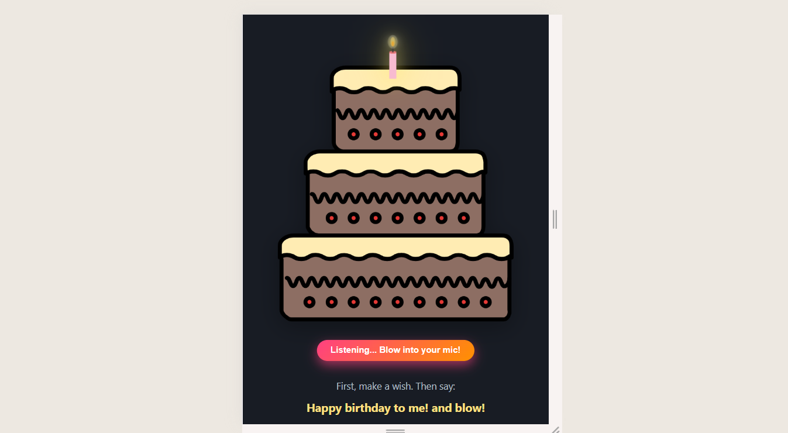

# 🎂 Interactive Birthday Cake - Voice-Controlled Celebration Web App

A delightful web experience where users can virtually blow out candles using voice commands, accompanied by music, animations, and confetti explosions. Perfect for remote birthday celebrations!

🌐 **Live Demo**: [Celebrate Now →](https://birthday-kohl-nine.vercel.app/)

[](https://birthday-kohl-nine.vercel.app/)

## ✨ Magical Features

| Feature          | Description                                                                 |
|------------------|-----------------------------------------------------------------------------|
| 🎙️ **Voice Control**  | Say "blow!" to extinguish candles (Web Speech API)                          |
| 🎼 **Dynamic Audio**  | Plays "Happy Birthday" song with realistic blowing sound effects            |
| ✨ **Visual Effects** | Lottie animations, particle confetti, and smooth candle glow transitions    |
| 📱 **Responsive**     | Fully functional on mobile, tablet, and desktop devices                     |
| 🎨 **Customizable**   | Easily edit the personal message and cake design in the config file         |

---

## 🛠️ Tech Stack

**Core Technologies**
- Frontend: HTML5, CSS3, Vanilla JavaScript (ES6+)
- Animations: Lottie Web, Canvas API
- Voice Recognition: Web Speech API
- Hosting: Vercel (Edge Network)

**Performance**
- 🚀 95+ Lighthouse Score
- 🌐 Progressive Web App (PWA) Ready
- 📦 Lightweight (Under 1MB total assets)

---

## 📸 Interactive Gallery

<div align="center">
  
   
  
</div>

---

## 🚀 Quick Start (For Developers)

```bash
git clone https://github.com/VIDAKHOSHPEY22/Birthday-Cake-Blow-Candle.git
cd Birthday-Cake-Blow-Candle

```
## 👩‍💻 About the Creator

Hi! I'm **Vida**, a self-taught full-stack developer from Iran.  
I love building fun and interactive projects that mix creativity and code.

This cake was made with care — and I'm open to feedback or improvements!  
Feel free to fork, suggest, or contribute.

📧 vviiddaa2@gmail.com | 💬 [@Vida_twin](https://t.me/Vida_twin) | 🔗 [GitHub](https://github.com/VIDAKHOSHPEY22)


## License

This project is licensed under the MIT License. See the [LICENSE](./LICENSE) file for details.
