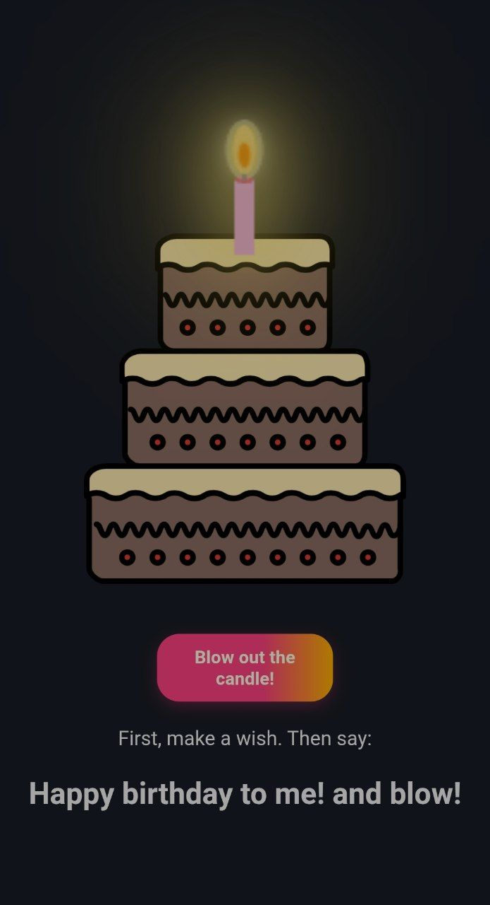
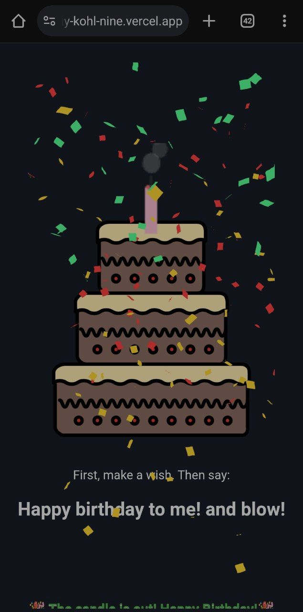
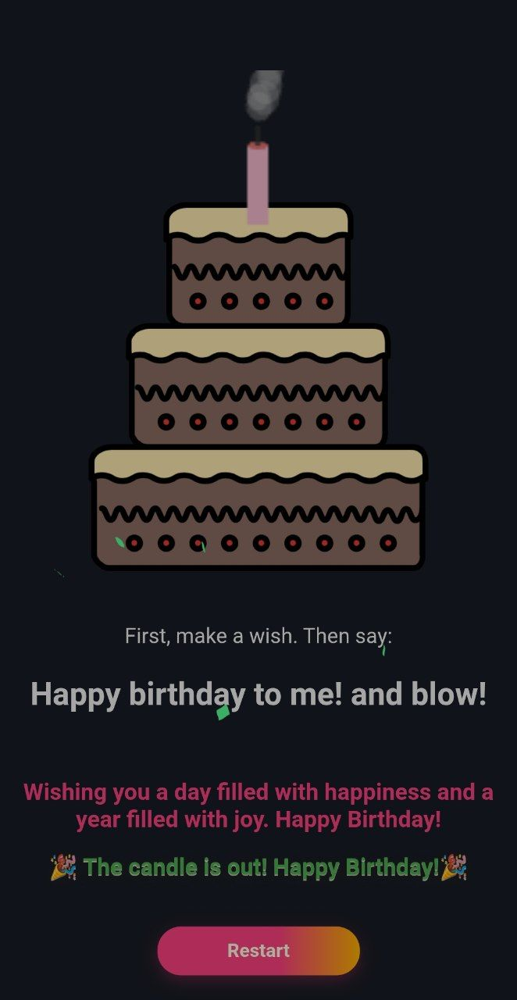

# 🎂 Interactive Birthday Cake Web App

A fun and interactive birthday website featuring a musical cake with animated candles you can blow out by voice!

🌐 **Live Demo**: [birthday-kohl-nine.vercel.app](https://birthday-kohl-nine.vercel.app/)

---

## ✨ Features

- 🕯️ **Animated birthday cake** with glowing candles  
- 🎙️ **Voice-controlled candle blowing** (just say “blow!”)  
- 🎶 **Happy Birthday music** with sound effects  
- 🎉 **Confetti and celebration animations**  
- 💬 **Personal message** displayed on-screen  
- 📱 Fully responsive on mobile and desktop

---

## 🛠️ Built With

| Front-End | Animation & Voice | Hosting |
|-----------|-------------------|---------|
| HTML5     | Lottie animations | Vercel  |
| CSS3      | Web Speech API    |         |
| Vanilla JS| Canvas API        |         |

---

## 📸 Screenshots

<p align="center">
  
  
  
</p>

---

## 🚀 Getting Started (For Developers)

```bash
git clone https://github.com/VIDAKHOSHPEY22/birthday
cd birthday


## 👩‍💻 About the Creator

Hi! I'm **Vida Khoshpey**, a self-taught full-stack developer from Iran.  
I love building fun and interactive projects that mix creativity and code.

This cake was made with care — and I'm open to feedback or improvements!  
Feel free to fork, suggest, or contribute.

📧 vviiddaa2@gmail.com | 💬 [@Vida_twin](https://t.me/Vida_twin) | 🔗 [GitHub](https://github.com/VIDAKHOSHPEY22)
